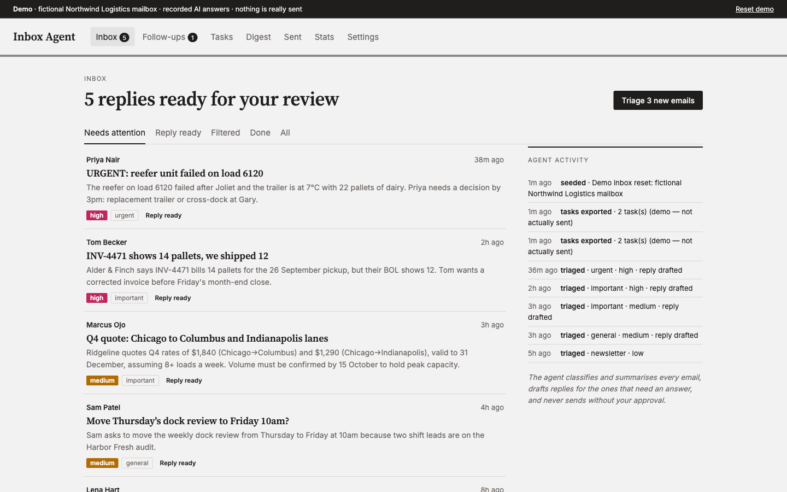
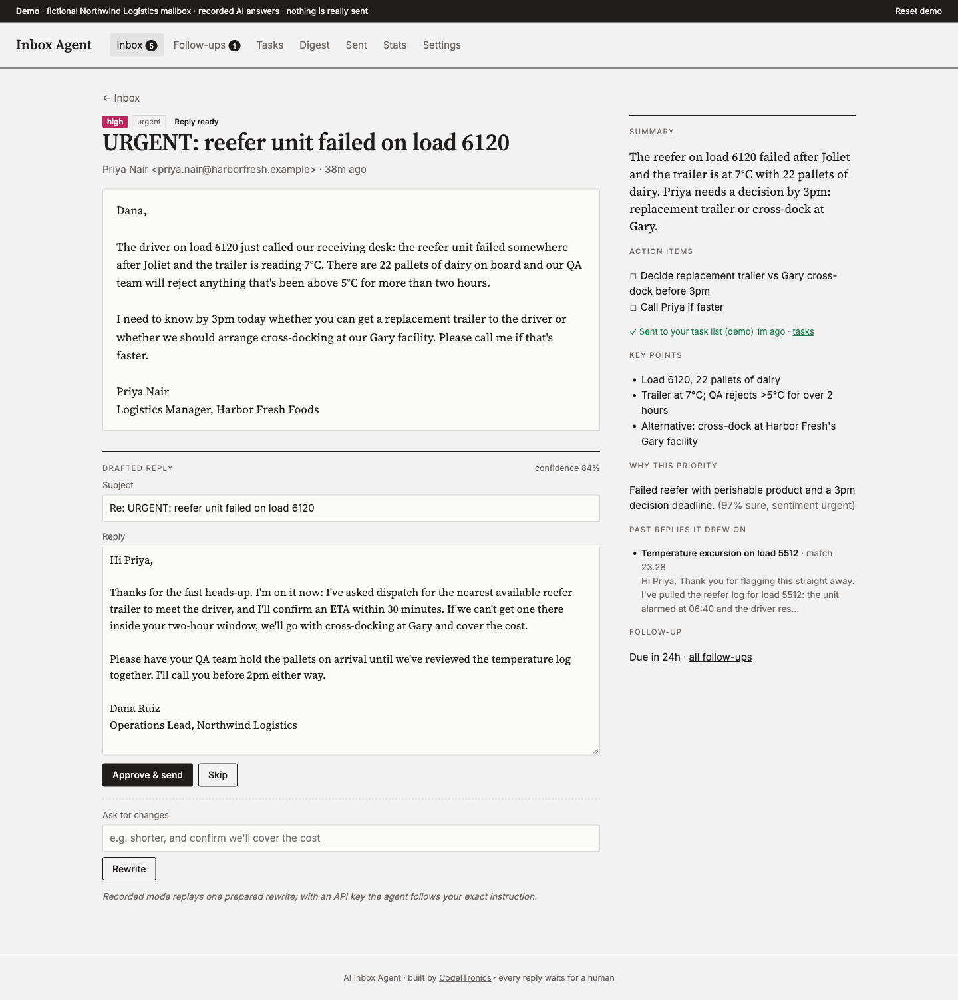
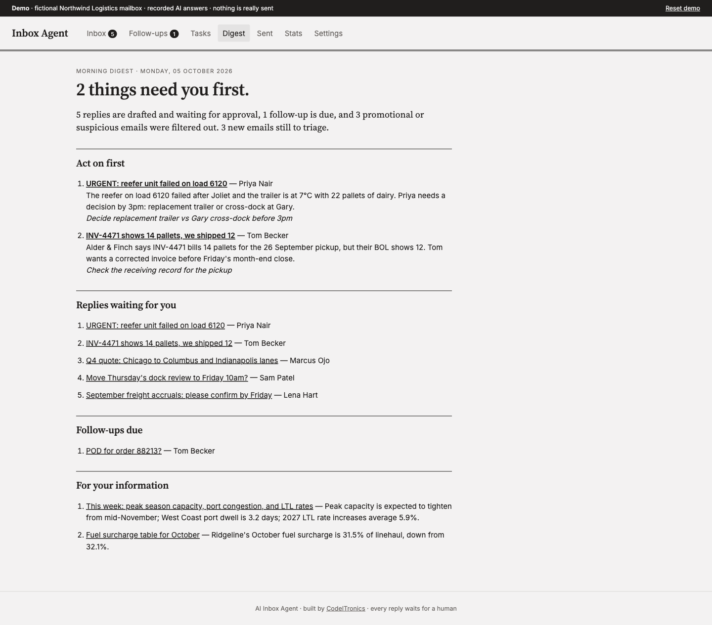
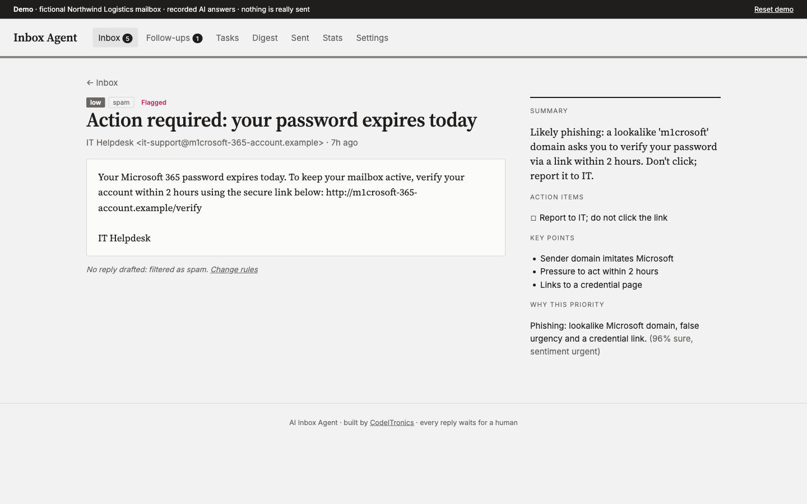
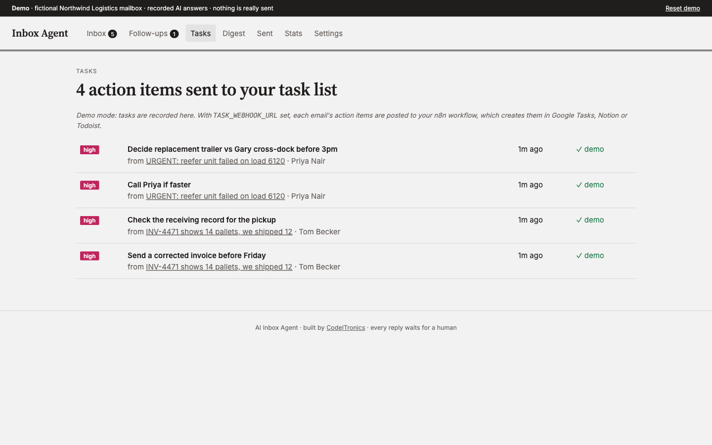

# AI Inbox Agent

An AI agent that works through an inbox the way a good assistant would. It sorts every email by category and priority, summarises it with the action items pulled out, drafts a reply in your voice based on how you answered similar emails before, and **waits for you to approve, edit or skip before anything is sent**.



**Try it without any setup:** the demo runs a fictional operations inbox (Northwind Logistics) with recorded AI answers. No Google account, no API key.

```bash
uv sync
uv run inbox-agent serve        # open http://127.0.0.1:8000
```

## What it does

| Step | What happens |
|---|---|
| **Fetch** | Pulls unread mail from Gmail (or the demo mailbox) into a local SQLite database. |
| **Classify** | Category (urgent, important, general, newsletter, promotional, spam) and priority (high, medium, low), with a confidence score and a one-line reason. Phishing is flagged, not answered. |
| **Summarise** | One or two sentences, key points, action items with deadlines, and sentiment. |
| **Draft** | For emails your rules say need an answer, it finds your most similar past replies and drafts a response in the same tone, citing which ones it used. |
| **Approve** | You approve and send, edit the text, ask for a rewrite in plain words ("shorter, and confirm we'll cover the cost"), or skip. With approval on (the default), nothing is sent without you. |
| **Remember** | Every approved reply becomes an example for future drafts, so drafts get closer to how you write. |
| **Tasks** | Action items go to your task app through a webhook. A ready-made n8n workflow creates them in Google Tasks (or Notion or Todoist). High-priority email is exported automatically; everything else takes one click. |
| **Follow up** | High-priority mail gets a next-day follow-up and medium-priority mail one after a few days (configurable), with Done and Snooze. |
| **Digest** | A morning page with what to act on first, replies waiting, follow-ups due, and what was filtered out. |

<table>
  <tr>
    <td></td>
    <td></td>
  </tr>
  <tr>
    <td></td>
    <td></td>
  </tr>
</table>

## Run it on your own Gmail

1. Create a Google Cloud project, enable the Gmail API, create an OAuth client of type *Desktop app*, and save it as `credentials.json` in this folder.
2. Install with Gmail support and configure:
   ```bash
   uv sync --extra gmail
   cp .env.example .env
   # set DEMO_MODE=false, WEB_PASSWORD, OWNER_NAME, OWNER_SIGNATURE and one AI provider key
   ```
3. Start it. The first run opens a browser window to authorise Gmail and stores `token.json` locally.
   ```bash
   uv run inbox-agent serve    # web UI (asks for WEB_PASSWORD)
   uv run inbox-agent run      # or: fetch and triage every POLL_INTERVAL_SECONDS
   ```

Your mail, drafts and reply history stay in `data/inbox.db` on your machine. The only data that leaves it is what is sent to the AI provider you choose.

### AI providers

Set one key and leave `AI_PROVIDER=auto`, or pick explicitly:

| Provider | Key | Default model (override with `AI_MODEL`) |
|---|---|---|
| Anthropic | `ANTHROPIC_API_KEY` | `claude-sonnet-5-5` |
| OpenAI | `OPENAI_API_KEY` | `gpt-5-mini` |
| Google Gemini | `GEMINI_API_KEY` | `gemini-2.5-flash` |
| DeepSeek | `DEEPSEEK_API_KEY` | `deepseek-chat` |
| Recorded | none | replays `inbox_agent/demo/recordings.json` |

### Send action items to your task app

1. In n8n, import [`integrations/n8n/inbox-agent-tasks.json`](integrations/n8n/inbox-agent-tasks.json), create the Header Auth credential described in its note, connect Google Tasks, and activate it.
2. Set `TASK_WEBHOOK_URL` to the workflow's production URL and `TASK_WEBHOOK_SECRET` to the same secret.

The agent POSTs one JSON body per email:

```json
{
  "source": "ai-inbox-agent",
  "email": { "id": "…", "subject": "…", "from": "…", "received_at": "…" },
  "priority": "high", "category": "urgent", "summary": "…",
  "tasks": [{ "title": "Decide replacement trailer vs cross-dock before 3pm", "notes": "From: … Subject: …" }]
}
```

Any endpoint that accepts this works: Zapier, Make or your own API.

### Rules

Edit these on the Settings page: whether approval is required, which categories get drafts, the minimum priority for a draft, and the follow-up delay.

## Commands

```bash
uv run inbox-agent serve [--host 0.0.0.0 --port 8000]   # web UI
uv run inbox-agent triage                                # fetch and triage once
uv run inbox-agent run                                   # fetch and triage on a loop
uv run inbox-agent digest                                # print today's digest
uv run inbox-agent demo-reset                            # reseed the demo mailbox
uv run pytest                                            # tests
```

## Public demo with Docker

`compose.yaml` runs the demo for anyone to try: recorded answers, a reset every hour, nothing sent. Keep API keys out of it, since anyone with the URL could spend them through *Rewrite*.

```bash
docker compose up -d --build    # listens on 127.0.0.1:8010
```

It's set up to be served at a path, `https://demos.codeitronics.com/inbox`, with `ROOT_PATH=/inbox`. Behind Traefik, add [`deploy/compose.traefik.yaml`](deploy/compose.traefik.yaml) (`docker compose -f compose.yaml -f deploy/compose.traefik.yaml up -d --build`); behind any other proxy, strip the `/inbox` prefix and forward to port 8010.

## How it's built

Python 3.12, FastAPI, Jinja templates with htmx, and SQLite. Similar past replies are found with BM25 over your approved replies. That is fast and dependency-free at the size of a personal inbox, and `inbox_agent/retrieval.py` is the one place to change if you want embeddings. See [docs/ARCHITECTURE.md](docs/ARCHITECTURE.md).

```
inbox_agent/
  pipeline.py    fetch → classify → summarise → draft → approve → send → remember
  agents.py      the three prompts (classifier, summariser, drafter)
  llm.py         Anthropic / OpenAI / Gemini / DeepSeek + recorded answers
  retrieval.py   BM25 over approved replies
  mailbox.py     Gmail and the demo mailbox
  store.py       SQLite
  web/           FastAPI app, templates, CSS
  demo/          fictional mailbox, recorded answers, seeder
integrations/n8n/  workflow that turns exported action items into Google Tasks
```

## License

MIT. See [LICENSE](LICENSE).

---

Built by [CodeITronics](https://codeitronics.com). We build AI agents and automation for operations teams.
